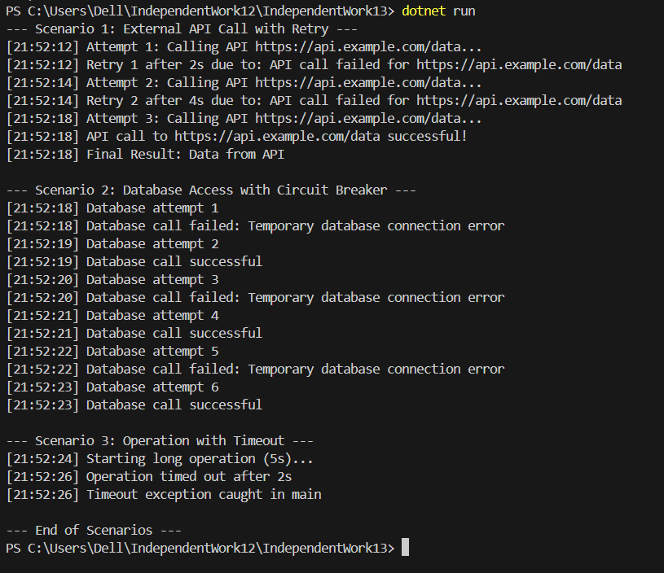

# IndependentWork13: Polly Scenarios — Retry, Circuit Breaker, Timeout

## Опис проєкту
Цей проєкт демонструє використання бібліотеки **Polly** для реалізації політик відмовостійкості у .NET застосунках.  
Розглянуто три сценарії: Retry, Circuit Breaker, Timeout.

## Сценарії
1. **Retry** — повторні спроби виклику зовнішнього API при тимчасових помилках.  
2. **Circuit Breaker** — блокування викликів бази даних при повторюваних помилках.  
3. **Timeout** — переривання довгих операцій, що перевищують допустимий час виконання.

## Технології
- C# (.NET 6 або вище)
- Polly (`Polly` NuGet package)
- Console logging (`Console.WriteLine`)

## Скрын запуску 

