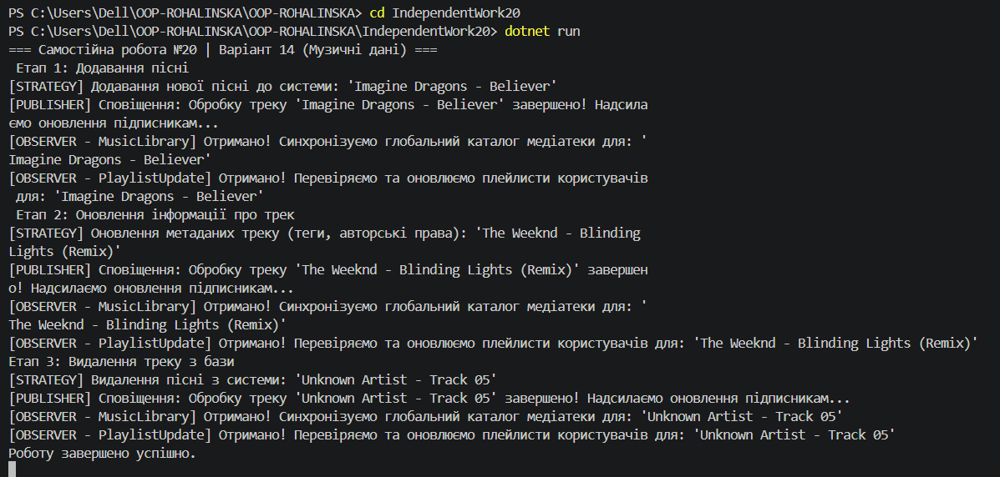

# Самостійна робота №20: Музичний процесор (Варіант 14)

Цей проєкт демонструє спільну роботу двох крутих патернів проєктування: **Strategy (Стратегія)** та **Observer (Спостерігач)** на прикладі системи обробки музичних треків.

---

## Що ми зробили (Простими словами)

Уявіть, що у нас є великий **Музичний плеєр/сервіс** (на кшталт Spotify). У ньому постійно щось відбувається з піснями. Замість того, щоб писати один гігантський код з купою `if-else` на кожен чих, ми розділили завдання між двома патернами:

1. **Патерн Strategy (Міняємо логіку на льоту):**
   Коли ми працюємо з треком, ми можемо робити з ним абсолютно різні речі: додавати його в базу (`AddSongStrategy`), видаляти (`RemoveSongStrategy`) чи оновлювати обкладинку й теги (`UpdateSongMetadataStrategy`). Наш головний об'єкт `DataContext` вміє перемикатися між цими діями миттєво прямо під час роботи програми. Ми просто кажемо йому: "Зараз працюй за цією стратегією", і він слухається.

2. **Патерн Observer (Автоматично шеримо новини):**
   Коли з піснею щось відбулося (вона додалася чи видалилася), про це мають дізнатися інші сервіси програми. Наприклад, сервіс загальної музичної бібліотеки (`MusicLibraryObserver`) та сервіс, що оновлює користувацькі плейлисти (`PlaylistUpdateObserver`). Замість того, щоб вручну викликати ці сервіси з кожної стратегії, ми створили **Видавця подій (`DataPublisher`)**. Обсерватори один раз підписуються на його подію, і як тільки трек оброблено — вони автоматично отримують сповіщення і роблять свою роботу.

---

## Контрольні питання та відповіді

### 1. Поясніть патерн Strategy. Як він дозволяє змінювати поведінку об’єкта під час виконання?
* **Відповідь:** Патерн Strategy виносить різні алгоритми чи варіанти поведінки в окремі класи, які мають один спільний інтерфейс. Головний об'єкт (Контекст) не знає деталей роботи алгоритму, він просто зберігає посилання на цей інтерфейс. Завдяки цьому ми можемо через звичайний метод-сеттер (`SetStrategy`) підставити інший об'єкт-стратегію прямо в рантаймі (під час виконання програми), і поведінка програми миттєво зміниться.

### 2. Поясніть патерн Observer. Як він забезпечує слабке зв’язування між суб’єктом та спостерігачами?
* **Відповідь:** Observer (Спостерігач) створює зв'язок "один-до-багатьох". Є один Головний Суб'єкт (Видавець) та багато Спостерігачів (Підписників). Слабке зв'язування (Loose Coupling) досягається тим, що Видавець взагалі не знає, хто на нього підписаний і що ці підписники будуть робити. Його задача — просто крикнути на всю програму: "Подія відбулась!". Ми можемо додавати нових підписників або видаляти старих, не змінюючи жодного рядка коду у самому Видавці.

### 3. Як події та делегати в C# використовуються для реалізації патерну Observer?
* **Відповідь:** В C# патерн Observer вже вбудований у саму мову через механізм **делегатів** (`Action`, `EventHandler`) та **подій** (`event`). Делегат — це тип, який вміє зберігати посилання на методи. Ключове слово `event` робить цей делегат безпечним (клієнти можуть лише підписуватися за допомогою `+=` або відписуватися через `-=`, але не можуть стерти інші підписи чи викликати подію без відома Видавця). Коли подія викликається через `Invoke()`, C# сам по черзі запускає всі підписані методи.

### 4. Наведіть приклад, як комбінація Strategy та Observer може створити гнучку та розширювану систему.
* **Відповідь:** У нашій роботі ми це чітко побачили. Якщо завтра бізнес попросить додати нову фічу — наприклад, "Конвертувати трек в MP3", ми просто створимо один новий клас `ConvertMP3Strategy` і підставимо його в Контекст. Код сповіщень (Observer) при цьому міняти взагалі не треба! А якщо треба додати нового отримувача сповіщень (наприклад, Telegram-бота, який пише про нові пісні), ми просто створимо `TelegramBotObserver` і підпишемо його на подію в `Program.cs`. Патерни дозволяють розширювати систему як конструктор Lego, не ламаючи стару працюючу логіку.

## Скрін виконаної роботи 
