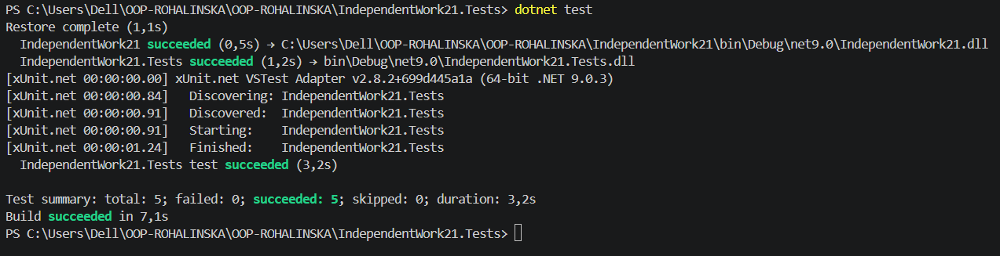
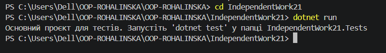

# Самостійна робота №21: Інтеграційні тести патернів

Цей проєкт містить автоматизовані інтеграційні тести для перевірки взаємодії чотирьох патернів проєктування: **Singleton**, **Factory Method**, **Strategy** та **Observer**. 

Всі тести написані за допомогою фреймворку **xUnit**.

---

## Що ми зробили (Простими словами)
Ми взяли архітектуру нашого музичного сервісу і замість того, щоб просто дивитися очима на вивід у консоль, написали спеціальний "контрольний код" (тести). Ці тести автоматично запускають систему, імітують дії користувача та перевіряють, чи все працює правильно:
* Чи фабрика створює правильний алгоритм?
* Чи наш єдиний менеджер (Singleton) не клонується і не губить дані?
* Чи долітають сповіщення до підписників?
* Що буде, якщо передати системі поламані або порожні дані?

---

## Звіт про тестування

Для перевірки коректності системи було реалізовано 5 інтеграційних сценаріїв. Всі тести успішно пройдені (`Passed`).

| № | Назва сценарію | Опис перевірки | Очікуваний результат | Фактичний результат | Статус |
|---|---|---|---|---|---|
| **1** | Позитивний: Робота фабрики та стратегії | Встановлюється `AddSongFactory`, яка створює `AddSongStrategy`. Запускається обробка треку. | Рядок успішно обробляється з префіксом `ADDED:`. | Дані додано в історію, префікс відповідає обраній стратегії. | **Passed** |
| **2** | Позитивний: Стабільність Singleton стану | Обробляється один трек, після чого створюється нове посилання на `MusicAppEngine.Instance` і додається другий трек. | Обидва посилання ведуть на один об'єкт. Історія містить обидва треки. Стані збережено. | Посилання ідентичні (`Same`), історія не втрачена, містить 2 елементи. | **Passed** |
| **3** | Позитивний: Спостерігач та рантайм-світч | Підписка на подію `OnSongProcessed`. Зміна стратегії з Додавання на Архівування прямо під час роботи. | Спостерігач отримує два різних повідомлення у правильній послідовності. | Спостерігач зафіксував зміну стратегії, дані актуальні. | **Passed** |
| **4** | Негативний: Запуск без стратегії | Виклик методу `Execute()` одразу після ініціалізації системи (до виклику фабрики). | Система має викинути помилку `InvalidOperationException`. | Викидається `InvalidOperationException` із правильним текстом повідомлення. | **Passed** |
| **5** | Граничний: Порожні вхідні дані | Передача у метод `Execute()` порожнього рядка `""` або пробілів `"   "`. | Система має захистити себе та викинути помилку `ArgumentException`. | Помилка успішно згенерована, порожні дані заблоковано. | **Passed** |

---

## Короткий висновок по ризиках (Risk Assessment)

Під час проєктування та інтеграційного тестування цієї системи було виявлено такі архітектурні ризики:

1. **Глобальний стан Singleton (State Pollution):** * *Ризик:* Оскільки Singleton живе протягом усього циклу роботи програми, дані від одного користувача або тесту можуть випадково вплинути на іншого (якщо історія `ExecutionHistory` не очищається).
   * *Рішення:* Було додано метод `Reset()`, який викликається у тестах через механізм `IDisposable` перед та після кожного прогону для забезпечення ізоляції.

2. **Витік пам'яті через події (Memory Leaks in Observer):**
   * *Ризик:* Якщо об'єкти-спостерігачі підписуються на подію Singleton-видавця (`Publisher.OnSongProcessed`), вони не будуть видалені з пам'яті збирачем сміття (Garbage Collector), поки живий сам Singleton. Це може призвести до витоку пам'яті у реальному великому додатку.
   * *Рішення:* Слід суворо контролювати відписку (`-=`) об'єктів, коли вони завершують свій життєвий цикл.

3. **Потокобезпека (Thread Safety):**
   * *Ризик:* За одночасного доступу кількох потоків до Singleton-сервісу та зміни стратегій у рантаймі (`SetStrategyViaFactory`), стан системи може стати непередбачуваним (Race Condition).
   * *Рішення:* Створення самого Singleton захищено через `lock` (Double-Check Locking), проте в майбутньому для роботи у багатопотоковому середовищі метод `Execute` також потребуватиме синхронізації або використання потокобезпечних колекцій (`ConcurrentBag`).

---

## Як запустити тести

1. Відкрийте термінал у папці `IndependentWork21.Tests`.
2. Виконайте команду:
   ```bash
   dotnet test

## Скрін виконаних тестів і завдання

