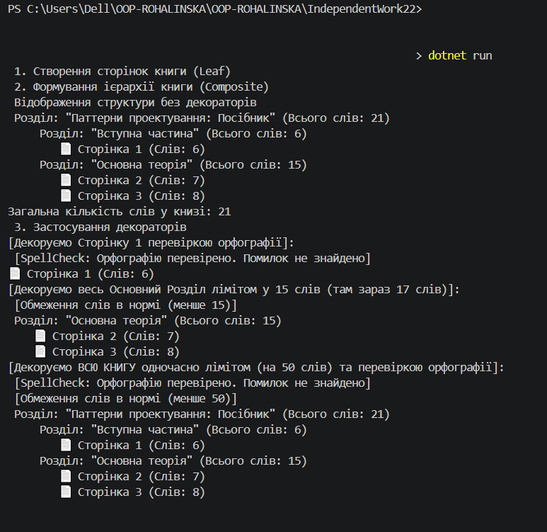

# Самостійна робота №22: Патерни Composite + Decorator (ВАРІНАНТ 14)

Цей проєкт присвячено практичному застосуванню структурних патернів проектування **Composite (Компонувальник)** та **Decorator (Декоратор)** на мові C# (Варіант №14 - Елементи книги).

## Мета роботи
Навчитися застосовувати патерни `Composite` та `Decorator` для створення гнучких та розширюваних систем, що працюють з ієрархічними структурами та динамічно додають функціональність до об’єктів без використання жорсткого наслідування.

---

## Теоретичні відомості

### Патерн Composite (Компонувальник)
Дозволяє об'єднати об'єкти в деревоподібну структуру типу "частина-ціле". Патерн змушує клієнта однаково трактувати як окремі об'єкти, так і їхні групи (контейнери).
* **IComponent** (`IComponent`) - спільний інтерфейс для всіх компонентів книги.
* **Leaf** (`Page`) - представляє кінцевий елемент (сторінку), який не має дочірніх компонентів і безпосередньо рахує слова.
* **Composite** (`Chapter`) - контейнер (розділ), що містить колекцію інших компонентів та рекурсивно підраховує загальну кількість слів.

### Патерн Decorator (Декоратор)
Дозволяє динамічно додавати нову функціональність об'єкту, загортаючи його в об'єкт-декоратор. Це забезпечує гнучку альтернативу успадкуванню під час проектування класів.
* **Base Decorator** (`BookDecorator`) - зберігає посилання на вкладений компонент і делегує йому роботу.
* **Concrete Decorators** (`SpellCheckDecorator`, `WordLimitDecorator`) - додають перевірку орфографії та контроль ліміту слів до або після базового виклику операції.

---

## Структура проєкту та варіант №14

Сценарій: **Елементи книги (сторінки, розділи, книга)**.

* `IComponent` - метод `GetWordCount()` (рахує слова) та `Display()` (виводить структуру).
* `Page` (Leaf) - містить `PageNumber` та `Content`.
* `Chapter` (Composite) - містить `Title` та список вкладених `IComponent`.
* `SpellCheckDecorator` - імітує перевірку орфографії.
* `WordLimitDecorator` - перевіряє, чи не перевищує поточна кількість слів заданий ліміт, та виводить попередження в консоль.

---

## Інструкція з запуску

1. Переконайтеся, що у вас встановлено .NET SDK (версії 6.0 або новішої).
2. Відкрийте термінал у папці з проєктом.
3. Виконайте команду для запуску:
   ```bash
   dotnet run
   
## Скрін виконаної 
