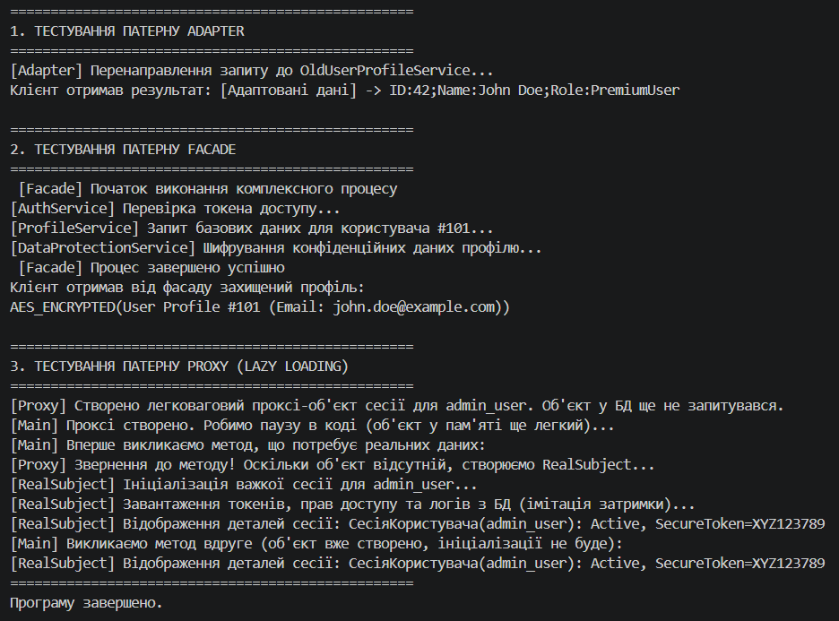

# Самостійна робота №23: Патерни Adapter + Facade + Proxy (ВАРІАНТ 14)

Цей проєкт присвячено практичному застосуванню та інтеграції трьох фундаментальних структурних патернів проектування: **Adapter (Адаптер)**, **Facade (Фасад)** та **Proxy (Заступник)** на прикладі обробки даних користувача (Варіант №14).

##  Мета роботи
Навчитися комбінувати патерни `Adapter`, `Facade` та `Proxy` для вирішення інтеграційних задач, спрощення архітектурних інтерфейсів та оптимізації доступу до ресурсів (через ледаче завантаження), а також обґрунтувати архітектурні компроміси при їх спільному використанні.

---

##  Теоретичні відомості та архітектурна роль патернів

Проєкт демонструє чітку різницю в призначенні схожих за структурою патернів:

1. **Adapter (Адаптер)** - *Змінює інтерфейс*. Перетворює застарілий або несумісний інтерфейс на контракт, який очікує сучасний клієнт. У цьому варіанті він адаптує `OldUserProfileService` до інтерфейсу `IUserProfileLoader`.
2. **Facade (Фасад)** - *Спрощує інтерфейс*. Надає єдину точку входу для роботи з цілим комплексом підсистем (автентифікація, завантаження профілю, шифрування), приховуючи від клієнта зайву складність.
3. **Proxy (Заступник)** - *Контролює доступ до інтерфейсу*. Реалізує ідентичний до реального об'єкта інтерфейс (`IUserSession`), додаючи поведінку **ледачого завантаження (Lazy Loading)** - важкі дані сесії створюються у пам'яті лише під час фактичного звернення клієнта.

---

##  Реалізований сценарій (Варіант №14)

Проєкт містить такі ключові компоненти:

* **Adapter**: `IUserProfileLoader` (Target) ← `UserProfileAdapter` (Adapter) ← `OldUserProfileService` (Adaptee, метод `LoadUser`).
* **Facade**: `UserFacade` з методом `GetSecureUserProfile(...)`, що оркеструє роботу внутрішніх сервісів: `AuthService`, `ProfileService` та `DataProtectionService`.
* **Proxy**: `IUserSession` (Subject), `RealUserSession` (RealSubject, що імітує важке завантаження з БД), `LazyUserSessionProxy` (Proxy, відкладає ініціалізацію сесії).

---

##  Інструкція з запуску

1. Переконайтеся, що на вашому комп'ютері встановлено .NET SDK 6.0 або новішої версії.
2. Відкрийте термінал у папці проєкту `IndependentWork23`.
3. Запустіть програму за допомогою команди:
   ```bash
   dotnet run

## Скрін виконаної роботи
