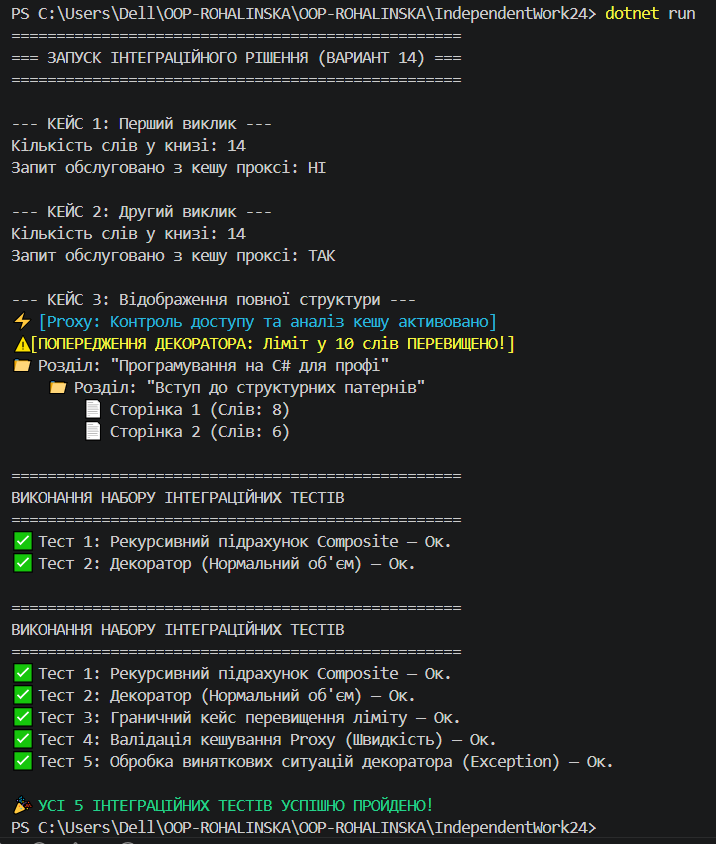

# Самостійна робота №24: Інтеграція структурних патернів та тестування

Цей проєкт демонструє наскрізну інтеграцію трьох структурних патернів проектування - **Composite (Компонувальник)**, **Decorator (Декоратор)** та **Proxy (Заступник)** - в єдиній системі аналізу текстової структури книги (Варіант №14).

## Мета роботи
Глибоко опанувати взаємодію структурних патернів в одному архітектурному рішенні, реалізувати автоматизовані перевірки граничних станів за допомогою тестів, а також оцінити компроміси продуктивності (Trade-offs) при впровадженні кешування.

---

## Архітектурна синергія патернів

В основі системи лежить єдиний контракт `IBookComponent`, що дозволяє прозоро комбінувати три різні архітектурні обов'язки:
1. **Composite (`Chapter` та `Page`)**  відповідає за деревоподібну структуру. Дозволяє взаємодіяти з цілою книгою, її розділами або окремими сторінками через рекурсивний підрахунок слів $O(N)$.
2. **Decorator (`WordLimitDecorator`)** - динамічно додає бізнес-правило перевірки ліміту слів до будь-якого елемента ієрархії, не захаращуючи класи самої структури.
3. **Proxy (`CachedWordCountProxy`)** - оптимізує ресурсомісткий рекурсивний обхід дерева шляхом **кешування**. Він перехоплює запити і повертає закешоване значення за константний час $O(1)$ для всіх повторних викликів.

---

## Опис інтеграційних тестів

У програму вбудовано 5 автоматизованих тестів, які перевіряють працездатність та стійкість системи:
* **Тест 1 (Composite):** Перевірка правильності рекурсивного підсумовування слів з різних гілок та рівнів вкладеності дерева.
* **Тест 2 (Decorator - Позитивний):** Валідація поведінки декоратора, коли поточний обсяг тексту знаходиться в межах дозволеного ліміту.
* **Тест 3 (Decorator - Граничний кейс):** Контроль спрацювання тригера попередження, коли ліміт перевищено рівно на 1 слово.
* **Тест 4 (Proxy - Продуктивність):** Перевірка життєвого циклу кешування (перший запит - промах кешу, другий запит - успішне зчитування з проксі).
* **Тест 5 (Негативний кейс):** Перевірка стійкості конструктора декоратора до некоректних вхідних даних (очікуване викликання винятку `ArgumentException` при спробі встановити від'ємний ліміт слів).

---

## Інструкція з запуску

1. Переконайтеся, що ви перебуваєте в папці проєкту `IndependentWork24`.
2. Виконайте в консолі команду для збирання та запуску:
   ```bash
   dotnet run
## Скрін виконаної роботи
