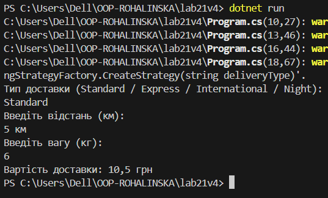

# Лабораторна робота №21
## OCP: гнучкі алгоритми розрахунку доставки

### Мета роботи
Навчитися створювати програму так, щоб до неї можна було легко додавати нові способи
розрахунку вартості доставки, **не змінюючи вже написаний код**.

## Опис проєкту
Це консольна програма на C#, яка рахує вартість доставки.
Ціна залежить від:
- типу доставки;
- відстані;
- ваги посилки.

Для кожного типу доставки використовується окремий спосіб розрахунку.

## Як працює програма
1. Користувач вводить тип доставки  
   (`Standard`, `Express`, `International` або `Night`)
2. Вводить відстань (у кілометрах)
3. Вводить вагу (у кілограмах)
4. Програма показує вартість доставки

## Типи доставки

- **Standard** - звичайна доставка
- **Express** - швидка доставка (дорожче)
- **International** - міжнародна доставка з податком
- **Night** - нічна доставка з додатковою націнкою

## Принцип OCP (простими словами)
Програма зроблена так, що:
- можна **додати новий тип доставки**;
- при цьому **не потрібно змінювати код**, який вже працює.

Наприклад, для нічної доставки був створений новий клас,
але клас `DeliveryService` не змінювався.

## Скрін

