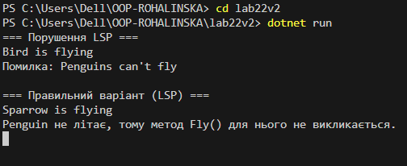

# Лабораторна робота №22

## Тема: LSP - виявлення порушень і альтернативні рішення  

## Мета роботи  
Розібратися з принципом підстановки Лісков (LSP), навчитися знаходити його порушення в ієрархіях класів та виправляти їх за допомогою зміни структури класів та використання інтерфейсів.  

## Коротка теорія  
Принцип LSP означає, що якщо код працює з базовим класом, то будь-який його підклас має працювати так само коректно.  
Програма не повинна ламатися або поводитися дивно, якщо замість базового класу підставити його нащадка.  
Якщо підклас не може нормально виконувати методи базового класу - це порушення LSP.

## Умова завдання (варіант 2: Bird & Penguin)  
- Базовий клас: `Bird` з методом `Fly()`  
- Похідний клас: `Penguin`  
- Проблема: пінгвіни не літають, але змушені мати метод `Fly()`, який кидає помилку  

## Початкова реалізація (порушення LSP)

```csharp
class Bird
{
    public virtual void Fly()
    {
        Console.WriteLine("Bird is flying");
    }
}

class Penguin : Bird
{
    public override void Fly()
    {
        throw new NotImplementedException("Penguins can't fly");
    }
}
```

**Чому це погано:**
Код, який працює з типом Bird, очікує, що будь-який птах може літати.
Але при використанні Penguin програма отримує помилку.
Тобто підклас не можна безпечно підставити замість базового класу - це і є порушення LSP.

## Клієнтський код, що показує проблему
```cshar
static void MakeBirdFly(Bird bird)
{
    bird.Fly();
}
```

При передачі об’єкта Penguin у цей метод виникає помилка під час виконання програми.

## Альтернативне рішення (дотримання LSP)
```cshar
interface IFlyingBird
{
    void Fly();
}

class Bird
{
    public string Name { get; set; }

    public Bird(string name)
    {
        Name = name;
    }
}

class Sparrow : Bird, IFlyingBird
{
    public Sparrow(string name) : base(name) { }

    public void Fly()
    {
        Console.WriteLine($"{Name} is flying");
    }
}

class Penguin : Bird
{
    public Penguin(string name) : base(name) { }
}
```

**Чому так краще:**
Тепер метод Fly() мають тільки ті птахи, які реально вміють літати.
Пінгвін не має зайвого методу, який йому не підходить.
Код працює з інтерфейсом IFlyingBird, тому помилки більше не виникають.

## Демонстрація в Main
У методі Main показано:
як виникає помилка в старому варіанті,
як нова реалізація працює коректно без помилок.

## Висновки
Принцип підстановки Лісков допомагає уникати помилок при використанні наслідування.
Якщо підкласи порушують поведінку базового класу, програма стає нестабільною.
Зміна ієрархії та використання інтерфейсів дозволяють побудувати більш правильну та гнучку архітектуру.

## Скрін виконання 

