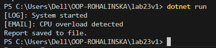

# Лабораторна робота №23  
## Тема: ISP & DIP. Dependency Injection через конструктор

### Мета роботи
Застосувати принципи **ISP (Interface Segregation Principle)** та  
**DIP (Dependency Inversion Principle)** для рефакторингу коду, а також реалізувати  
**Dependency Injection (DI)** через конструктор для зменшення зв’язаності та покращення тестування.

## Опис завдання

Було реалізовано систему **SystemMonitor**, яка виконує:
- логування подій  
- надсилання сповіщень  
- генерацію звітів  

У початковій версії програми були порушені принципи **ISP** та **DIP**.  
Після цього було виконано рефакторинг із застосуванням SOLID-принципів.

## Проблеми у початковій версії

### Порушення ISP
Використовувався один великий інтерфейс, який змушував класи залежати від методів, що можуть бути їм не потрібні.

### Порушення DIP
Клас `SystemMonitor` сам створював залежності (`Logger`, `EmailSender`, `FileReportGenerator`), що створювало жорстку прив’язку до конкретних реалізацій.

### Розділення інтерфейсів (ISP)
Було створено окремі інтерфейси:
- `ILogger` - відповідає лише за логування  
- `INotifier` - відповідає лише за сповіщення  
- `IReportGenerator` - відповідає лише за генерацію звітів  

### Інверсія залежностей (DIP)
Клас `SystemMonitor` більше не створює залежності самостійно.  
Тепер він працює з **абстракціями (інтерфейсами)**.

### Dependency Injection (DI)
Усі залежності передаються в `SystemMonitor` через **конструктор**.

## Висновки

У результаті виконання лабораторної роботи:

- Код став менш зв’язаним  
- Покращилась гнучкість та розширюваність програми  
- З’явилась можливість легко підміняти залежності (наприклад, для тестування)  
- Було практично застосовано принципи **ISP**, **DIP** та механізм **DI**

## Скрін виконання 

