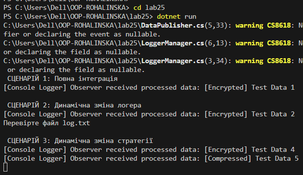

# Лабораторна робота №25
## Тема
Інтеграція патернів (підготовка до екзамену).

## Мета роботи

Розробити систему, що демонструє взаємодію між компонентами, які реалізують патерни
Factory Method, Singleton, Strategy та Observer, а також переконатися в коректності їхньої спільної
роботи.

# Що реалізовано
## Патерн Strategy

Використовується для зміни алгоритму обробки даних.

Є інтерфейс:
```csharp
public interface IDataProcessorStrategy
{
    string Process(string data);
}
```
Реалізації:

- EncryptDataStrategy - "шифрування" даних

- CompressDataStrategy - "стиснення" даних

Клас-контекст:
```csharp
public class DataContext
{
    private IDataProcessorStrategy _strategy;

    public DataContext(IDataProcessorStrategy strategy)
    {
        _strategy = strategy;
    }

    public void SetStrategy(IDataProcessorStrategy strategy)
    {
        _strategy = strategy;
    }

    public string Execute(string data)
    {
        return _strategy.Process(data);
    }
}
```
Стратегію можна змінювати під час виконання програми.

## Патерн Factory Method

Використовується для створення різних типів логерів.

Інтерфейс логера:
```csharp
public interface ILogger
{
    void Log(string message);
}
```
Реалізації:

- ConsoleLogger

- FileLogger

Абстрактна фабрика:
```csharp
public abstract class LoggerFactory
{
    public abstract ILogger CreateLogger();
}
```
Конкретні фабрики:

- ConsoleLoggerFactory

- FileLoggerFactory

Дає можливість створювати логери без жорсткої прив’язки до реалізації.

## Патерн Singleton

Клас LoggerManager гарантує існування лише одного екземпляра менеджера логування.
```csharp
public class LoggerManager
{
    private static LoggerManager _instance;
    private LoggerFactory _factory;

    private LoggerManager() { }

    public static LoggerManager Instance
    {
        get
        {
            if (_instance == null)
                _instance = new LoggerManager();
            return _instance;
        }
    }

    public void SetFactory(LoggerFactory factory)
    {
        _factory = factory;
    }

    public ILogger GetLogger()
    {
        return _factory.CreateLogger();
    }
}
```
Дозволяє змінювати фабрику під час виконання.

## Патерн Observer

Використовується для повідомлення інших компонентів про завершення обробки даних.

Клас-паблішер:
```csharp
public class DataPublisher
{
    public event Action<string> DataProcessed;

    public void Publish(string data)
    {
        DataProcessed?.Invoke(data);
    }
}
Клас-спостерігач:
public class ProcessingLoggerObserver
{
    public void Subscribe(DataPublisher publisher)
    {
        publisher.DataProcessed += OnDataProcessed;
    }

    private void OnDataProcessed(string data)
    {
        var logger = LoggerManager.Instance.GetLogger();
        logger.Log($"Processed: {data}");
    }
}
```

Спостерігач автоматично реагує на подію.

## Сценарії роботи програми
### Сценарій 1 - Повна інтеграція

- Logger - Console

- Strategy - Encrypt

- Observer підписаний

- Дані обробляються та логуються у консоль

### Сценарій 2 - Динамічна зміна логера

- Після першої обробки фабрика змінюється на FileLoggerFactory

- Логування відбувається у файл log.txt

### Сценарій 3 - Динамічна зміна стратегії

- Після першої обробки стратегія змінюється на CompressDataStrategy

- Дані обробляються новим алгоритмом

## Висновок

У роботі продемонстровано інтеграцію чотирьох патернів проєктування:

- Strategy забезпечує гнучкість алгоритмів

- Factory Method відповідає за створення об'єктів

- Singleton централізує керування логуванням

- Observer забезпечує слабке зв’язування компонентів

Система є розширюваною та відповідає принципам SOLID.

## Скрін

